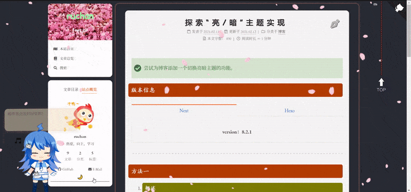


尝试为博客添加一个切换亮暗主题的功能。


<!--more-->

## 版本信息


<!-- tab Next -->

<strong><div align="center">version：8.2.1</div></strong>

<!-- endtab -->

<!-- tab Hexo-->
<strong><div align="center">hexo: 5.3.0
hexo-cli: 3.1.0</div></strong>
<!-- endtab -->



---

## 方法一

1. ### 概述
	简单的添加一个button按钮，并为按钮以及黑暗模式设计样式，最后加入为按钮的 onclick 事件而设计的 js 代码。
	
2. ### 添加 button
	button 的位置取决于存在哪个元素对应的 njk 文件中，这里我将 button 放在 sidebar 中。故而先前往 _config.yml 取消 custom_file_path 关于 sidebar.njk 的注释，然后在`站点根目录/source/_data`下建立文件 sidebar.njk（已有sidebar.njk 的可忽略此步）。在其中加入：

   ```
   <a id="theme_change"
           type="button"
           onclick="theme_change()"
   >
      🌞
   </a>
   ```

3. ### 设计样式

   同理取消关于 styles.styl 的注释并建立此文件，并在该文件中加入关于主题切换 button 的样式。

   

   styles.styl 中能加入博客所有元素的样式设计代码。为了方便管理，我这利用 @import 引入绝对路径下的样式代码。

   

   此处的 button 属于自定义内容，故而我在 _data 下创建文件夹 custom，并在其中建立 dark-theme.styl，然后在 styles.styl 文件中加入：

   ```stylus
   /*自定义主题样式设置*/
   @import "custom/dark-theme";
   ```

   最后在 dark-theme.styl 中加入：

   ```stylus
   // 黑暗主题样式
   body.dark-theme {
       background: #282c34		/* 设置黑暗主题背景颜色 */
   }
   ```

   这里我添加的 button 属于超链接（`<a></a>`），若利用`<button></button>`，还能在 dark-theme.styl 中设计 button 元素的样式，详情见[此文](http://pygo2.top/articles/41680/)。
   
4. ### 添加 JS

   由`onclick="theme_change()"`可知当我们点击 🌞 这个 button 时，会执行`theme_change()` 这个函数。所以设计并添加 `theme_change()`：建立`source/js/theme_change.js`文件，在 theme_change.js 中设计`theme_change()`，最后引入 theme_change.js 。具体如下：

   ```javascript
   // source/js/theme_change.js
   // 主题切换功能
   function theme_change() {
       // 切换字内容
       var button = document.getElementById('theme_change');
       var pattern = new RegExp('🌞', 'i');
       if (pattern.test(button.innerHTML)){
           button.innerHTML = "🌙";
       } else{
           button.innerHTML = "🌞";
       }	
       // 切换主题
       document.body.classList.toggle('dark-theme');
   	setCookie("inner",button.innerHTML,1)
   };
   ```

   同前所述，取消 footer.njk 的注释，并建立`source/_data/footer.njk`（此文件以及 body-end.njk 均被我用作引入 js）。footer.njk 中加入：

   ```nginx
   {# 自定义黑暗主题切换 #}
   <script type="text/javascript" src="/js/theme_change.js"></script>
   ```

   至此已完成，效果如下：

   
